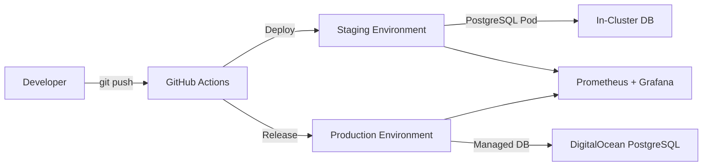

# 🚀 Formerr - Modern Form Builder

> **Aplicação completa de formulários com FastAPI + Next.js e deploy automatizado multi-cloud**

[](https://github.com/your-org/formerr/actions)
[](LICENSE)
[](https://python.org)
[](https://nextjs.org)

## 🎯 Quick Start

### 💻 Desenvolvimento Local (5 minutos)

```bash
# 1. Clone o repositório
git clone https://github.com/your-org/formerr.git
cd formerr

# 2. Configure as variáveis de ambiente
cp .env.example .env
# Edite o .env com suas credenciais GitHub OAuth

# 3. Inicie a aplicação
docker-compose up -d

# 4. Acesse a aplicação
# Frontend: http://localhost:3000
# Backend: http://localhost:8000/docs
```

### 🚀 Deploy em Produção

1. **Configure os secrets** no GitHub repository
2. **Push para main** → Deploy automático staging
3. **Crie uma release** → Deploy manual produção

---

## 📚 Documentação Completa

👉 **[LEIA O GUIA COMPLETO](./README_COMPLETO.md)** 👈

O guia completo inclui:
- 🏗️ **Arquitetura detalhada** e decisões técnicas
- 🔧 **Configuração step-by-step** de secrets e infraestrutura
- 💻 **Setup local** com e sem Docker
- 🚀 **Deploy multi-cloud** automatizado
- 📊 **Monitoramento** com Prometheus + Grafana
- 🔧 **Troubleshooting** e comandos úteis

---

## 🛠️ Stack Tecnológica

| Componente | Tecnologia | Versão |
|------------|------------|--------|
| **Backend** | FastAPI + Python | 3.11 |
| **Frontend** | Next.js + TypeScript | 14 |
| **Database** | PostgreSQL | 15 |
| **Auth** | GitHub OAuth + JWT | - |
| **Infrastructure** | Kubernetes + Terraform | - |
| **Cloud** | DigitalOcean | - |
| **CI/CD** | GitHub Actions | - |
| **Monitoring** | Prometheus + Grafana | - |

---

## 🌟 Principais Funcionalidades

- ✅ **Formulários Dinâmicos**: Criação e gerenciamento de formulários
- ✅ **Autenticação OAuth**: Login via GitHub com JWT
- ✅ **API RESTful**: FastAPI com documentação automática
- ✅ **Interface Moderna**: Next.js 14 com App Router
- ✅ **Deploy Automatizado**: CI/CD com GitHub Actions
- ✅ **Infraestrutura como Código**: Terraform modular
- ✅ **Monitoramento**: Métricas e alertas integrados
- ✅ **Multi-Ambiente**: Staging e produção isolados

---

## 🏗️ Arquitetura Resumida



### 💰 Custos Otimizados

- **Staging**: ~$30/mês (PostgreSQL in-cluster = $0)
- **Production**: ~$60/mês (Managed DB + HA)
- **Economia**: $180-300/ano vs arquitetura anterior

---

## 🤝 Contribuindo

1. Fork o projeto
2. Crie uma branch: `git checkout -b feature/nova-funcionalidade`
3. Commit: `git commit -m 'Add: nova funcionalidade'`
4. Push: `git push origin feature/nova-funcionalidade`
5. Abra um Pull Request

---

## 📄 Licença

Este projeto está sob a licença MIT. Veja o arquivo [LICENSE](LICENSE) para detalhes.

---

## 🆘 Suporte

- 📖 **Documentação**: [README_COMPLETO.md](./README_COMPLETO.md)
- 🐛 **Issues**: [GitHub Issues](https://github.com/your-org/formerr/issues)
- 💬 **Discussões**: [GitHub Discussions](https://github.com/your-org/formerr/discussions)

---

**Desenvolvido com ❤️ pela equipe Formerr**
